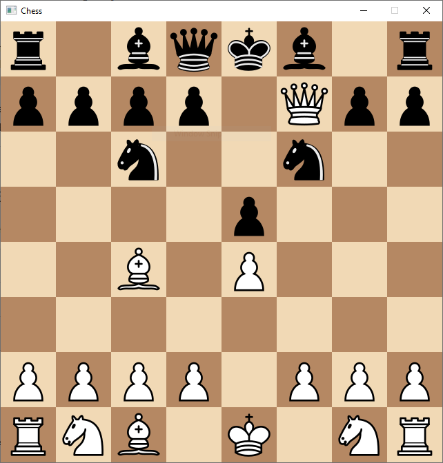

# Chess

This is my first project, a simple chess implementation in C++ with SDL2 used for rendering.

### todo:

1. highlight checks and checkmates
1. select promotions within the window
1. ability to play as white or black
1. repetition
1. halfmoves
1. fullmoves
1. count all the moves up to certain depth and compare with expected results
1. create a chess engine
